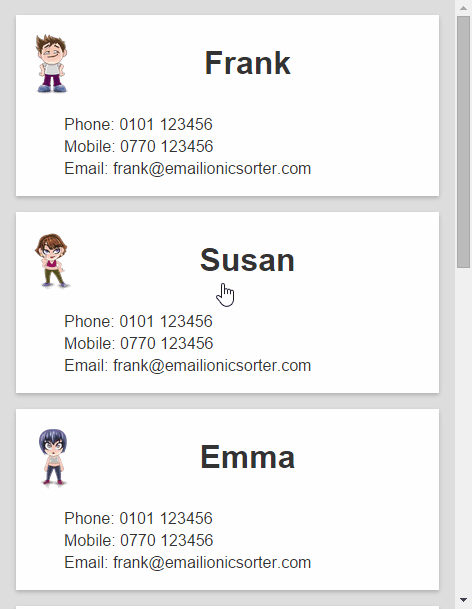

Angular-Hero
============

Create hero transitions with Angular, similar to those implemented by Google Polymer's [core-animated-pages](https://www.polymer-project.org/docs/elements/core-elements.html#core-animated-pages).

##Example

Example project here: [Angular-Hero-Sample](https://github.com/DevAndyLee/Angular-Hero-Sample)



##Usage

1. Include `alAngularHero` as a dependency in your Angular app.

    ```js
    angular.module('app', ['alAngularHero'])
    ```

2. Include the supplied CSS file or add the `.hero-animating` style to your own.

3. Declare the page transitions to use on the `ng-view` element, including `hero-transition`:
    ```html
    <div ng-view class="page-transition hero-transition"></div>
    ```
4. Identify hero elements with the `hero` class and `hero-id` attribute:
    ```html
    <div class="name hero" hero-id="name">{{contact.name}}</div>
    ```

    The `hero-id` attribute should be the same on both pages to trigger a hero animation from one to the other.

Note that for the element styles to animate correctly, hero elements should be styled by a directly applied class.
For example, styling the contact name in the above example with this CSS won't work:
```css
.screen1 .name { color: red; }
```

The hero element is moved out of `.screen1` during the animation, so will lose its color.
Instead, add a class to the element and style directly. e.g.
```css
.screen1-name { color: red; }
```

This also means that css styles will be animated during the transition.
For example, if the target element is blue, then we'll see an animated transition from red to blue.
You can also animate other syles in this way, such as corner-radius and borders etc...

###Install via Bower

```
bower install angular-hero
```

